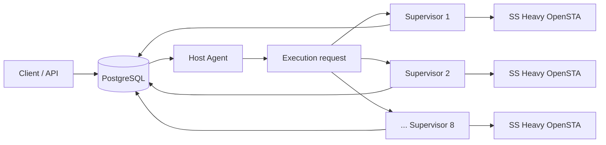

# PostgreSQL delivery / Kafka challenger decision

작성일: 2026-09-30  
상태: closed by predeclared experiment rule; final human review pending

## Decision question

> 현재 PostgreSQL 기반 Run polling / atomic claim / state coordination 구조는 SS Heavy 실행 capacity보다 빠르게 backlog가 누적될 때 실제 coordination 한계를 보이는가? 그 한계가 Kafka challenger를 열 정도인가?

## Evidence used

Accepted isolated backlog points:

| Runs | makespan | queue wait p95 | trusted terminal | lock wait | DB connections max | full-slot sample ratio |
| ---: | ---: | ---: | ---: | ---: | ---: | ---: |
| 8 | 12.065 s | 0.161 s | 8/8 | 0 | 11 | 84.6% |
| 32 | 48.196 s | 35.634 s | 32/32 | one sampled waiter | 11 | 91.8% |
| 128 | 184.400 s | 170.068 s | 128/128 | 0 across 93 samples | 11 | 93.5% |

At 128 Runs, all eight OpenSTA Supervisors were repeatedly sampled at roughly 98–100% of their one-CPU caps while PostgreSQL was sampled near 1–2% CPU and roughly 52–53 MiB of its 384 MiB limit. No deadlock, rollback, duplicate Attempt/delivery, unexpected `UNAVAILABLE`, lease/recovery failure, or provenance mismatch occurred in the accepted 128 point.

Full evidence: [PostgreSQL backlog / coordination evidence](../evidence/2026-09-30-postgres-backlog-coordination.md)

## Trigger evaluation

### Performance trigger

Not met.

- There was no sustained execution-slot starvation attributable to PostgreSQL.
- The isolated 128 point recorded zero sampled lock wait and zero deadlock/rollback delta.
- Maximum database connection count stayed at 11.
- Backlog-induced queue wait grew strongly, but eight OpenSTA execution slots stayed near saturation.
- The single lock waiter sampled at 32 Runs did not reproduce at the larger 128 point.
- No evidence shows that a Kafka delivery layer would improve end-to-end SS Heavy throughput under the same execution capacity.

### Requirement trigger

Not met for the current scope.

No current requirement was recorded for retained events, replay, independent multiple consumers, consumer groups, partition ordering, event reprocessing, or a product-level durable event backlog.

## Decision

Keep PostgreSQL as:

- authoritative Run / Attempt state;
- idempotency and ownership/fencing store;
- accepted-completion and provenance store;
- bounded Run polling / atomic claim / execution-request coordination mechanism.

Do not implement Kafka in this cycle.

This does **not** claim that Kafka is unnecessary for every future workload. Kafka becomes a challenger only if a future measurement shows a repeated PostgreSQL coordination limit after one reasonable PostgreSQL-side correction, or if one of the explicit event-stream requirements becomes real.

## Why 512 / 1,024 were not executed

128 Runs already created a sustained backlog with p99 queue wait around 171 seconds while preserving all correctness invariants. The measured resource split continued to show OpenSTA CPU saturation and low PostgreSQL pressure. Extending to 512/1,024 would mostly spend additional Heavy execution time after the decision signal had already satisfied the stop rule.

## Current architecture

Kafka is intentionally absent.

## Next gate

Open a separate multi-host correctness cycle only after human review.

Question:

> 단일 Host에서 검증한 execution ownership / recovery invariant가 실제 두 Host에서도 유지되는가?

Bound it to ownership/recovery fault injection rather than another throughput expansion. Kafka is not a prerequisite.
