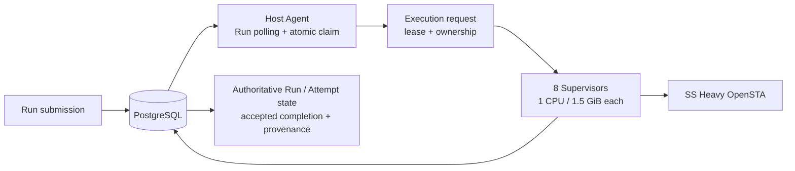

# PostgreSQL backlog / coordination evidence

작성일: 2026-09-30  
상태: measurement in progress  
계획: [PostgreSQL backlog / coordination bounded cycle](../plans/2026-09-30-postgres-backlog-coordination-cycle.md)

## Preconditions

선행 SS Heavy resource/scaling cycle은 종료됐다.

- 동일 SS Heavy input, Supervisor 1/2/4/8, 각 3회, Run 8개.
- Supervisor당 1 CPU / 1.5 GiB.
- 모든 accepted point가 동일 SS Liberty / Heavy netlist / calibration script provenance를 기록했다.
- 1/2/4/8 각 24/24 `SUCCEEDED/TRUSTED`.
- 8-Supervisor point: median makespan 12.743 s, p95 13.182 s, PostgreSQL lock wait maximum 0.
- queued delivery lease expiry 결함은 `9ad020a`에서 수정됐다. Host Agent는 Supervisor claim 전 `QUEUED` delivery의 Attempt lease만 갱신하고, claim 뒤 heartbeat 책임은 Supervisor가 가진다.
- 잘못된 Supervisor 수와 pre-fix lease-expiry 결과는 기존 raw evidence에 rejected 상태로 보존한다.

이번 cycle은 Heavy/PVT/resource calibration을 확장하지 않는다.

## Fixed environment

- application revision: `9ad020ac5cf454a411307aca13f73e9b84c6c2a2`
- benchmark harness: working-tree measurement helper, 결과 해석에는 application revision과 분리해 기록
- container image: `eda-ss-backlog:9ad020a`, observed image id prefix `f0c9dd04b835`
- Docker Linux VM: 8 CPU / 20,926,898,176 B
- PostgreSQL: 16-alpine pinned image, 0.5 CPU / 384 MiB
- Host Agent: one isolated agent, 0.6 CPU / 128 MiB, dispatch cap 8
- Supervisors: 8, each 1 CPU / 1.5 GiB
- SS Liberty SHA-256: `9b24f0db3967ac67b4cae1f74bb480fd47922d18d0ed577e3c121739b412c361`
- Heavy netlist SHA-256: `b3f09a42b23a9ff84c0084d4d284a9f8f5830b4c50f4972d68f59a18ea0938ce`
- calibration script SHA-256: `cad5237c39e914222b23d6f30a86c6c34d5782bad5480dc7c8714607fb2688a1`
- corner: `ss_100C_1v60`

Final accepted measurements use an isolated PostgreSQL container/database so stale experimental workers cannot consume the same global `eda_runs` queue. This preserves the PostgreSQL version/resource configuration while removing cross-experiment worker contamination.

## Rejected / invalid measurements

### Rejected 32-Run batch — cross-profile worker contamination

Prefix: `ss-backlog-32-cfc7ad35a8cd4b4f9b60842c95576cb9-`

The batch reached 32/32 terminal success but is **not accepted evidence**. Existing `m1-agent-a` was still polling the same global `eda_runs` queue. It claimed some new backlog Runs and dispatched them to `phase5-supervisor-*`, whose runtime profile was not the fixed SS Heavy profile.

Observed contamination included:

- `phase5-supervisor-1`: default TT Liberty + tiny netlist/default script on multiple Runs.
- `phase5-supervisor-5/7/8`: non-SS Liberty on additional Runs.
- 11 Runs failed the expected provenance check.

Action:

1. reject batch;
2. retain prefix and diagnosis;
3. add allowed-Supervisor validation to the harness;
4. stop unrelated polling workers for the retry;
5. subsequently move final accepted measurements to an isolated PostgreSQL instance.

This is experimental condition contamination, not evidence of a PostgreSQL coordination limit.

### Rejected 128-Run attempts — duplicate benchmark launch after tool timeout

Prefixes:

- `ss-backlog-128-48974babbb844d82b6901b02dac6642d-`: 128 terminal Runs
- `ss-backlog-128-9b03a69634f04e8eb2fe214467a21a30-`: 40 terminal Runs

A long-running tool invocation timed out/replayed and two 128-Run benchmark processes overlapped. Both prefixes are rejected because arrival rate/backlog was no longer the single-batch condition. They remain identifiable in the original `eda_m1` database and are not included in final metrics.

The final 128 point is launched once with detached execution and explicit completion-file polling to prevent replay from creating a second batch.

## Metric semantics

`delivery_claim_wait_seconds` is execution-request creation → Supervisor claim wall time. It includes waiting for a free Supervisor and poll cadence. It is **not** PostgreSQL statement execution latency. Therefore it is interpreted together with execution-slot utilization, PostgreSQL lock wait/CPU, and connection pressure.

## Accepted measurements

### 8 Runs — isolated baseline

Prefix: `ss-backlog-8-ac25fd3e925f439aaa8ab529d79c829d-`

- 8/8 `SUCCEEDED/TRUSTED`
- duplicate Attempt / delivery: 0
- unexpected Supervisor / `UNAVAILABLE`: 0
- provenance mismatch: 0
- makespan: 12.065 s
- submit latency p50 / p95 / p99: 1.210 / 3.215 / 3.215 ms
- delivery claim wait p50 / p95 / p99: 77.685 / 89.903 / 89.903 ms
- queue wait p50 / p95 / p99: 157.861 / 161.460 / 161.460 ms
- PostgreSQL connections max: 11
- sampled lock wait max: 0
- execution slot fraction max: 1.0

### 32 Runs — isolated backlog

Prefix: `ss-backlog-32-153d2735e0ef43f1ae270189578851dd-`

- 32/32 `SUCCEEDED/TRUSTED`
- duplicate Attempt / delivery: 0
- unexpected Supervisor / `UNAVAILABLE`: 0
- provenance mismatch: 0
- makespan: 48.196 s
- submit latency p50 / p95 / p99: 1.162 / 3.437 / 27.108 ms
- delivery claim wait p50 / p95 / p99: 54.243 ms / 11.637 s / 11.655 s
- queue wait p50 / p95 / p99: 17.859 / 35.634 / 35.772 s
- PostgreSQL connections max: 11
- sampled lock wait max: 1; this single observation is not yet a repeated contention result
- execution slot fraction max: 1.0
- full-slot sample ratio: 91.8%
- while Run backlog remained, only two samples were under full slots: initial dispatch (0/8) and one transition sample (7/8)

The long delivery wait is consistent with execution-slot occupancy: once the first wave starts, all eight OpenSTA slots stay filled across almost the entire backlog interval. It is not by itself a PostgreSQL bottleneck.

### 128 Runs — isolated backlog

Prefix: `ss-backlog-128-49578192da8b41f68a7874c42cb5170c-`

- 128/128 `SUCCEEDED/TRUSTED`
- duplicate Attempt / delivery: 0
- unexpected Supervisor / `UNAVAILABLE`: 0
- lease/recovery failure: 0
- provenance mismatch: 0
- makespan: 184.400 s
- submit latency p50 / p95 / p99: 0.883 / 1.486 / 1.836 ms
- delivery claim wait p50 / p95 / p99: 89.211 ms / 11.116 s / 11.738 s
- queue wait p50 / p95 / p99: 84.424 / 170.068 / 170.762 s
- PostgreSQL connections max: 11
- sampled PostgreSQL lock wait: 0 in all 93 samples
- deadlock / transaction rollback delta: 0 / 0
- run queue depth max: 120
- delivery queue depth max: 8
- execution slot fraction mean: 96.5%
- full-slot sample ratio: 93.5%
- of 86 samples taken while Run backlog remained, four were under full slots; one is initial dispatch and three are short 6/8 or 7/8 transition observations. None coincided with a sampled PostgreSQL lock wait.

The queue grew until p99 wait exceeded 170 seconds, but the accepted-completion and ownership invariants held. PostgreSQL did not show repeated lock, connection, deadlock, or CPU pressure while the OpenSTA execution slots remained near saturation.

## Resource separation sample during 128 Runs

At approximately 24 seconds into the accepted 128 attempt:

- all eight Supervisors sampled at approximately 98–100% of each one-CPU cap;
- each Supervisor used about 944.6 MiB of the 1.5 GiB limit at that instant;
- PostgreSQL sampled at 1.49% CPU and 51.74 MiB / 384 MiB;
- Host Agent sampled at 1.27% CPU and 45.05 MiB / 128 MiB.

A second sample around the later part of the same run again showed all eight Supervisors at approximately 98–100% CPU, PostgreSQL at 1.24% CPU / 53.39 MiB, and Host Agent at 0.83% CPU / 45.45 MiB.

After completion, all eight Supervisor containers reported `OOMKilled=false`. Their cgroup memory peaks ranged from 1,299,120,128 B to 1,309,282,304 B, below the 1.5 GiB cap.

These are point/resource-bound observations, not integrated CPU profiles. Together with the queue/slot samples they support separating OpenSTA execution saturation from an obvious PostgreSQL CPU or memory ceiling.

## Kafka trigger decision

**Case A — Kafka trigger not met.**

Performance trigger:

- execution slots did not show sustained coordination-caused starvation;
- submission remained stable through 128 Runs;
- the single sampled lock wait at the 32-Run point did not reproduce at 128 Runs;
- 128 Runs recorded zero lock-wait samples, zero deadlocks, zero rollbacks, and a stable maximum of 11 database connections;
- PostgreSQL point samples remained near 1–2% CPU while all eight OpenSTA Supervisors were CPU saturated;
- the large increase in end-to-end queue wait is explained by fixed 8-slot execution capacity, not by evidence that PostgreSQL delivery became the limiting resource.

Requirement trigger:

- retained event: not required
- replay: not required
- independent multiple consumers: not required
- consumer-group delivery: not required
- partition ordering: not required
- product requirement for a large durable event backlog: not recorded
- event reprocessing: not required

Decision: keep PostgreSQL as the current delivery/coordination mechanism for the validated scope. Do **not** implement Kafka in this cycle.

The planned 512/1,024 backlog points are not run merely to increase the number. By 128 Runs, p99 queue wait already exceeded 170 seconds while correctness remained intact and the execution slots, rather than PostgreSQL, were saturated. This is sufficient to exercise a sustained backlog under the bounded VM without expanding Heavy workload cost after the decision signal is already clear.

## Current architecture

PostgreSQL remains both the authoritative state store and the bounded delivery/coordination mechanism. No separate Kafka delivery layer is present.

## Verified claims

- The queued-delivery lease ownership correction remains compatible with a sustained Run backlog: no unexpected `UNAVAILABLE`, lease/recovery failure, stale completion, duplicate Attempt, or duplicate delivery was observed in the accepted 8/32/128 points.
- Under the fixed same-VM profile, 128 submitted SS Heavy Runs drained to 128/128 trusted terminal results.
- In that profile, PostgreSQL lock/connection/CPU pressure was not the observed end-to-end capacity limit; OpenSTA Supervisor CPU saturation was.
- Kafka's predeclared performance and requirement triggers were not met.

## Not verified

- production capacity or production SLO
- real customer EDA workloads
- full MCMM/sign-off workload
- physical multi-host throughput
- generic optimal Supervisor count
- autoscaling behavior
- Kafka superiority/inferiority outside this measured requirement set
- failure behavior for a retained/replayable event-stream requirement that does not currently exist

## Failure modes found during this cycle

1. **Cross-profile worker contamination:** a non-isolated shared global Run queue allowed an older Host Agent to claim some experimental Runs. The affected 32-Run batch was rejected; the harness now rejects unexpected Supervisor IDs and final measurements use an isolated PostgreSQL instance. This also exposes an architectural constraint for future multi-host work: polling Hosts must use a compatible execution profile, or Run-to-Host capability/routing must become an explicit contract.
2. **Duplicate 128 launch after tooling timeout/replay:** two benchmark processes overlapped. Both batches were rejected; the accepted 128 run was launched once in detached mode and polled by an explicit completion file.
3. **Live-DB integration-test contamination after measurement:** contract tests passed, but pointing schema-initializing integration tests at the live benchmark DB caused a migration/query deadlock that terminated the Host Agent after the accepted measurements were already complete. This is not included in backlog metrics. The test itself explicitly requires a dedicated disposable PostgreSQL database; future integration tests must honor that contract.

## Regression verification

The lease/Host Agent regression was rerun against a separate disposable PostgreSQL database after the measurement environment was closed:

- `tests/contract/test_host_agent.py`: 9/9 passed.
- `tests/integration/test_host_agent_postgres.py`: 1/1 passed.
- The disposable-test rerun completed without the live-benchmark DDL/runtime collision.

## Next Human Decision Gate — multi-host

The PostgreSQL/Kafka delivery decision is closed before multi-host work begins.

Next question:

> 단일 Host에서 검증한 execution ownership / recovery invariant가 실제 두 Host에서도 유지되는가?

If approved, run only the bounded two-Host correctness/fault-injection cycle: shared PostgreSQL, Run distribution across A/B, Host Agent loss, child alive/dead, completion-boundary loss, stale Host/Agent fencing, no confirmed-live/new-Attempt overlap, and a bounded host-reboot simulation if feasible. Kafka is not a prerequisite for that cycle.

## Portfolio summary

고정된 SS Heavy 환경에서 PostgreSQL 기반 Run polling/atomic claim 구조에 8→32→128개 backlog를 주입해 delivery 한계를 분리 검증했습니다. 128개 Run에서 p99 queue wait는 약 171초까지 증가했지만 128/128 결과가 신뢰 상태로 종료됐고, 중복 실행·예상치 못한 `UNAVAILABLE`·provenance 불일치는 발생하지 않았습니다. 같은 구간에서 8개 OpenSTA Supervisor는 CPU cap을 거의 계속 사용한 반면 PostgreSQL은 lock wait 0, deadlock 0, 최대 11 connections와 낮은 CPU 사용을 보여 병목을 실행 자원 쪽으로 분리했습니다. 사전에 정의한 Kafka trigger가 충족되지 않아 Kafka를 추가하지 않고 PostgreSQL coordination을 유지하는 결정을 남겼습니다.

## Limits

- Same Docker Linux VM, not physical multi-host throughput.
- Submission/measurement helper runs inside the Host Agent container because external DSN forwarding was blocked by the execution environment. It therefore shares the Host Agent's 0.6-CPU cgroup during measurement. This limitation is conservative for coordination-side overhead and is not a production API topology.
- No production SLO is inferred.
- No Kafka implementation is started unless the predeclared trigger is met.
